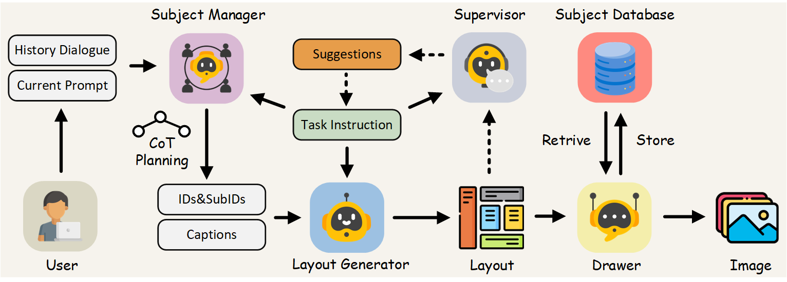

<div align="center">

## AutoStudio: Crafting Consistent Subjects in Multi-turn Interactive Image Generation
[📄[Paper](https://arxiv.org/abs/2406.01388)] &emsp; [🚩[Project Page](https://howe183.github.io/AutoStudio.io/)] <br>


</div>

## Model Architecture


## Abstract
As cutting-edge Text-to-Image (T2I) generation models already excel at producing remarkable single images, an even more challenging task, i.e., multi-turn interactive image generation begins to attract the attention of related research communities. This task requires models to interact with users over multiple turns to generate a coherent sequence of images. However, since users may switch subjects frequently, current efforts struggle to maintain subject consistency while generating diverse images. To address this issue, we introduce a training-free multi-agent framework called AutoStudio. AutoStudio employs three agents based on large language models (LLMs) to handle interactions, along with a stable diffusion (SD) based agent for generating high-quality images. Specifically, AutoStudio consists of (i) a subject manager to interpret interaction dialogues and manage the context of each subject, (ii) a layout generator to generate fine-grained bounding boxes to control subject locations, (iii) a supervisor to provide suggestions for layout refinements, and (iv) a drawer to complete image generation. Furthermore, we introduce a Parallel-UNet to replace the original UNet in the drawer, which employs two parallel cross-attention modules for exploiting subject-aware features. We also introduce a subject-initialized generation method to better preserve small subjects. Our AutoStudio hereby can generate a sequence of multi-subject images interactively and consistently. Extensive experiments on the public CMIGBench benchmark and human evaluations show that AutoStudio maintains multi-subject consistency across multiple turns well, and it also raises the state-of-the-art performance by 13.65% in average Fréchet Inception Distance and 2.83% in average character-character similarity.

Previous work: [TheaterGen](https://github.com/donahowe/TheaterGen)
## TODO
- [ ] Release huggingface demo
- [x] Release SDXL version code
- [x] Release SDv1.5 version code

## :fire: News
* **[2024.06.26]** AutoStudio got 200🌟!
* **[2024.06.22]** Bugs are fixed, SDXL version released
* **[2024.06.11]** We have release the SDv1.5 code
* **[2024.06.06]** We have release the repository

## 🚀 Run
1. Prepare all the pretrained checkpoints of SD (strongly recommand `dreamlike-art/dreamlike-anime-1.0`) and IP-Adapter
2. Prepare `/DETECT_SAMefficient_sam_s_gpu.jit` and `/DETECT_SAM/Grounding-DINO/groundingdino_swint_ogc.pth` for groundingdino and efficientSAM
3. create the environment and run this code:

```
python run.py
```

## 👀 Contact Us
If you have any questions, please feel free to email us at howe4884@outlook.com.
🌟🌟🌟(I am an undergraduate student actively seeking opportunities for a Ph.D. program in 25 fall.)🌟🌟🌟


## Citation
If you found this code helpful, please consider citing:
~~~
@article{cheng2024autostudio,
  title={AutoStudio: Crafting Consistent Subjects in Multi-turn Interactive Image Generation},
  author={Cheng, Junhao and Lu, Xi and Li, Hanhui and Zai, Khun Loun and Yin, Baiqiao and Cheng, Yuhao and Yan, Yiqiang and Liang, Xiaodan},
  journal={arXiv preprint arXiv:2406.01388},
  year={2024}
}
~~~

